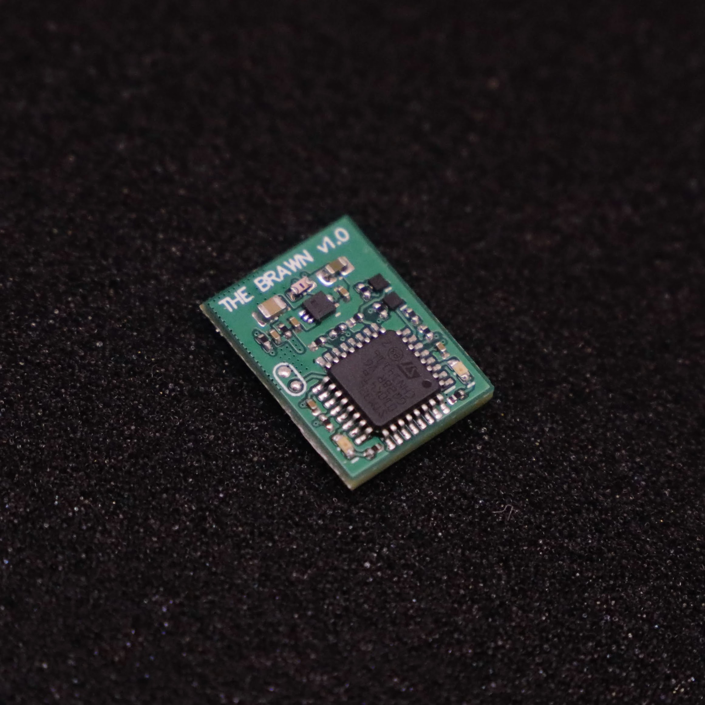
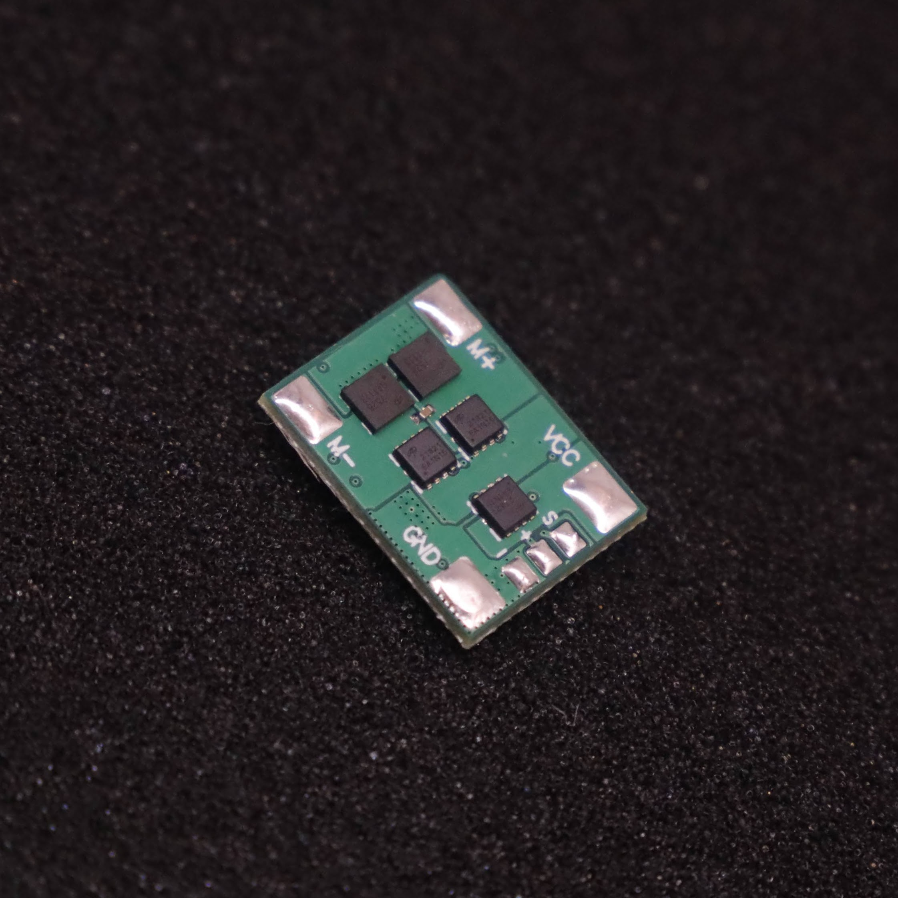
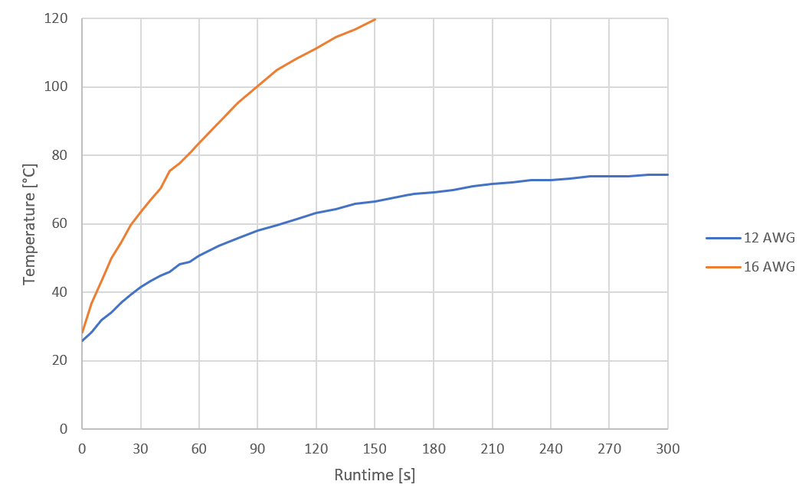

# THE BRAWN - 20A (v1.0)

 

THE BRAWN is a single DC-motor ESC: originally designed for insect-weight combat-robots, but is suitable for any appliction requiring a lightweight motor driver. 

Designed and built in [Christchurch, New Zealand ](https://www.google.co.nz/maps/place/Christchurch+New+Zealand) by Connor Benton, visit [cb-technology](https://www.cb-technology.co.nz/) for details.

## FEATURES
- Single Bi-Directional DC-motor output.
- Ultra-compact and lightweight.
- Under-voltage and reverse-polarity battery input protections.
- Run and status LED's.
- Instant power on and brown out recovery.
- Internal BEC for recievers.
- Includes a 100nF capacitor across the motor output to filter noise and voltage spikes.

## SPECIFICATIONS
- **Dimensions:** 20x15x4 mm
- **Weight:** 1.7g *excluding wires*
- **Input Voltage - Rated:** 1-3S lipo (3.3-12.6V)
- **Input Voltage - Absolute Max:** 18V
- **Output Current - Continuious:** 10A *(for more infomation see the Current Rating seciton)*
- **Output Current - Pulse:** 66A 
- **Motor Braking:** Enabled
- **BEC:** 3.3V, 200mA. Designed to power the radio reciever and other downstream ESC's but no motors or servos.
- **Signal Input:** Standard Servo PWM
     
## Fault Conditions
 - **Under-Voltage:** An under-voltage event occurs when the battery voltage falls below a pre-determined threshold.
    - At 3.6V (per cell) the device enters a warning state. This is only a warning and so functionality is not affected but the warning LED is illuminated for the operator.
    - At 3.4V (per cell) the device enters an under-voltage fault state. All motor functionality will be stopped until battery voltage is restored.
 - **Signal-Input:** A signal-input fault will occur if connection to the radio is lost for 50 ms. 
    - During a signal-input fault, a 'No Signal' fail-safe method is implemented and THE BRAWN will stop driving the motor output.
    - When a radio connection has been re-established the motor functionality is immediately resumed.

## LED Behaviour
There are two LEDs on THE BRAWN: 1x red Run LED and 1x green Status LED. The behaviour of each LED indicates what state the device is in.
 - **Normal Operation** Red: ON, Green: OFF
 - **Warning: Low Battery** Red: ON, Green: Flash
 - **Fault: Under-Voltage:** Red: Flash, Green: Flash
 - **Fault: Signal Input:** Red: OFF, Green: Flash

## Current Rating
The current rating of THE BRAWN is temperature-limited and so is very dependednt on the wires (gauge, length, and insulation) and avalible cooling. It is the responsibility of the user to choose the correct wires and test it appropriately before stressing the THE BRAWN in combat. 

As a guide, constant-current thermal testing has been conducted to illistrate the thermal characteristics. *Note: This test has been conducted at constant current, resulting in a higher temperature than the pulse currents in many drive applications.*

##### Reference testing parameters:
 - **Voltage:** 12V
 - **Motor Wire Length:** 100 mm
 - **Battery Wire Length:** 100 mm
 - **Wire Insulation:** PVC
 - **Ambient Temperature:** 23.5 °C
 - **PCB Heatshrink:** Yes
 - **ESC Cooling:** Open-Air passive cooling

##### Constant Current = 5A

##### Constant Current = 8A

##### Constant Current = 10A

