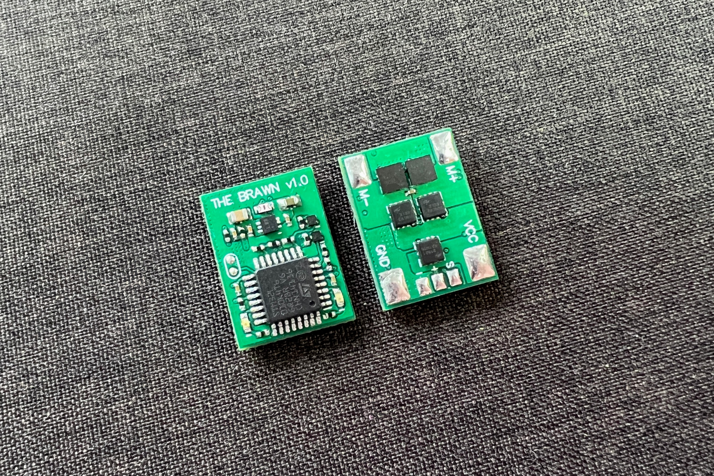

# THE_BRAWN v1.0

THE_BRAWN is a single DC-motor ESC: originally designed for insect-weight combat-robots, but is suitable for any appliction requiring a lightweight motor driver.

Designed and built in [Christchurch, New Zealand ](https://www.google.co.nz/maps/place/Christchurch+New+Zealand) by Connor Benton, visit [CB-Technology](https://www.cb-tech.co.nz/) for details.

## FEATURES
- Single Bi-Directional DC-motor output.
- Ultra-compact and lightweight.
- Under voltage and reverse polarity battery input protections.
- Auto detect battery input voltage scaling.
- Run and status LED's.
- Instant power on and brown/black out recovery.
- Internal BEC for recievers.
- Includes a 100nF capacitor across the motor output to filter noise and voltage spikes.

## SPECIFICATIONS
- **Dimensions:** 20x15x4 mm
- **Weight:** 1.7g *excluding wires*
- **Input Voltage - Rated:** 1-3S lipo (3.3-12.6V)
- **Input Voltage - Absolute Max:** 18V
- **Output Current - Continuious:** *see Current Rating below*
- **Output Current - Pulse:** 66A 
- **Motor Braking:** Enabled
- **BEC:** 3.3V, 200mA. Designed to power the radio reciever and other downstream ESC's but no motors or servos.
- **Signal Input:** Standard Servo PWM

## I/O Wiring Diagram
It is recommended to increase the wire gauge as much as practicable for your given application. 
The current rating is temperature-limited and so the larger gauge wire used (on motor and battery I/O) will increase the performance. 

     
## Fault Conditions
 - **Under-Voltage:** An under-voltage event has two states depending on severity:
    - At 3.6V (per cell) the device enters a low-battery warning state. This is only a warning for the operator that battery is running low, operating function is not affected.
    - At 3.4V (per cell) the device enters an under-voltage fault state. All motor functionality will be stopped until battery voltage is restored.
 - **Signal-Input:** A signal-input fault will occur if connection to the radio is lost for 50 ms (3 radio updates). 
    - During a signal-input fault, a 'No Signal' fail safe method is implemented and THE_BRAWN will stop driving the motor output.
    - When a radio connection has been re-established the motor functionality is immediately resumed.

## LED Behaviour
There are two LEDs on THE_BRAWN: 1x red Run LED and 1x green Status LED. The behaviour of each LED indicate what state the device is in.
 - **Normal Operation** Red: ON, Green: OFF
 - **Warning: Low Battery** Red: ON, Green: Flash
 - **Fault: Under-Voltage:** Red: Flash, Green: Flash
 - **Fault: Signal Input:** Red: OFF, Green: Flash

## Current Rating
The current rating of this motor driver is **very** dependent on the wires used (gauge, length, and insulation material).
It is the responsibility of the user to choose the correct wires for their  setup and to test within their desired operating temperature. 

As a guide, some test have been conducted with different wire lengths to illistrate the thermal characteristics of the motor driver.  
Note: All testing has been conducted at constant current. This will result in much higher temperatures that what is observed during general operation which equates to the motor stall-current when paring with your motors. Despite this, most motors are rarely run at stall for anyting longer than momentary, so depending on your application you may be able to get away with

Testing parameters:
 - **Voltage:** 12V
 - **Motor Wire Length:** 100 mm
 - **Wire Insulation:** PVC
 - **Ambient Temperature:** 23.5 °C
 - **PCB Heatshrink:** Yes
 - **Air Flow:** Open Air Passive Cooling (No Fan or simmilar)

###### 5A Continuious Current

###### 10A Continuious Current

###### 15A Continuious Current

